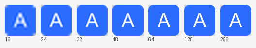

# Icogen

> 中文文档 ｜ **English:** [README.md](README.md)

从单张源图生成 Windows 应用图标（`AppIcon.ico`）以及 WinUI 3 / Windows App
SDK 所需的资源 PNG。每项功能同时提供 CLI 和基于 GPUI 的图形界面 —— 共四个
独立 `.exe`，零运行时依赖。

## 快速开始

从 [GitHub Releases](../../releases) 下载预编译的 Windows 二进制（或
[从源码构建](#从源码构建)），然后：

```powershell
# 从图片生成 AppIcon.ico
icogen.exe logo.png

# 生成 WinUI 3 / Windows App SDK 资源 PNG（输出到 Assets\）
icogen-assets.exe logo.png
```

想用图形界面？运行 `icogen-gui.exe` / `icogen-assets-gui.exe`，把图片拖进
窗口（或点击选择文件），选好选项即可生成。

## 使用方法

### `icogen` — AppIcon.ico 生成器

```text
icogen <输入图片> [选项]
```

| 选项 | 说明 | 默认值 |
| --- | --- | --- |
| `-o, --output <路径>` | 输出 `.ico` 路径 | `AppIcon.ico` |
| `-s, --sizes <列表>` | 内嵌尺寸，逗号分隔 | `16,24,32,48,64,128,256` |
| `--mode <模式>` | `contain`（完整显示，留透明边）或 `cover`（裁剪铺满） | `contain` |
| `-b, --background <颜色>` | 纯色背景，如 `#1e293b` 或 `white` | 透明 |
| `--pad <比例>` | contain 模式下的内边距，0–1 | `0` |
| `--verify` | 生成后读回校验各帧 | 关 |

示例：

```powershell
icogen logo.png
icogen logo.png -o AppIcon.ico --mode cover
icogen logo.png -b "#111827" --mode cover --verify
```

### `icogen-assets` — WinUI 3 资源生成器

```text
icogen-assets <输入图片> [选项]
```

| 选项 | 说明 | 默认值 |
| --- | --- | --- |
| `-o, --output <目录>` | 输出目录 | `Assets` |

在当前目录下生成输出目录（默认 `Assets/`）并写入 8 个平台 PNG —— 请在项目
根目录运行。

### 图形界面

`icogen-gui` 和 `icogen-assets-gui` 以 GPUI 窗口提供同样的功能：拖放或原生
文件对话框、逐个尺寸/目标的开关、每一帧的实时预览、可编辑的输出路径。
`icogen-gui` 还提供 contain/cover 模式、背景色预设和内边距。两者都支持命令行
传入可选的图片路径和 `-o <输出>`，并会记住窗口的大小与位置，下次启动时
恢复。

## 生成内容

### AppIcon.ico

单个 `.ico` 内嵌七个尺寸 —— `16 / 24 / 32 / 48 / 64 / 128 / 256` px：

- **256 px** 帧使用 PNG 压缩（文件小、高 DPI 下清晰）。
- 其余小尺寸使用 32 位 BGRA 位图，支持 alpha 透明。



### WinUI 3 资源

输出 8 个 PNG 到 `Assets/`：

| 输出文件 | 尺寸 |
| --- | --- |
| `Square150x150Logo.scale-200.png` | 300×300 |
| `Square44x44Logo.scale-200.png` | 88×88 |
| `Square44x44Logo.targetsize-24_altform-unplated.png` | 24×24 |
| `Square44x44Logo.targetsize-48_altform-lightunplated.png` | 48×48 |
| `LockScreenLogo.scale-200.png` | 48×48 |
| `StoreLogo.png` | 50×50 |
| `Wide310x150Logo.scale-200.png` | 620×300 |
| `SplashScreen.scale-200.png` | 1240×600 |

正方形目标直接缩放；宽屏目标等比缩放后居中贴在透明画布上。

## 从源码构建

需要 [Rust 工具链](https://rustup.rs/) 和 Windows 10/11 SDK（`rc.exe` 用于
把窗口图标嵌入 GUI 二进制）—— 均仅编译时需要。

一键构建 —— 编译全部四个二进制并拷贝到 `dist/`：

```powershell
# Windows PowerShell
.\build-dist.ps1

# 或 Git Bash
./build-dist.sh
```

手动构建 —— 产物落在 `dist/release/`：

```bash
cargo build --release
```

已开启体积优化（`opt-level=z` + LTO + strip）。`.cargo/config.toml` 把所有
构建产物保留在项目内已 gitignore 的 `dist/` 目录，而非全局 cargo home。

## 目录结构

```
icogen/
├── assets/                 # GUI 二进制内嵌的应用图标
│   └── app.ico
├── crates/                 # 全部二进制与库
│   ├── icogen/             # icogen.exe — AppIcon.ico CLI
│   ├── icogen-assets/      # icogen-assets.exe — WinUI 3 资源 CLI
│   ├── icogen-assets-gui/  # icogen-assets-gui.exe — WinUI 3 资源 GUI
│   ├── icogen-core/        # 公共逻辑（lib）
│   ├── icogen-gui/         # icogen-gui.exe — AppIcon.ico GUI
│   └── icogen-ui/          # 公共 GPUI 组件与配色（lib）
├── dist/                   # 构建产物与成品二进制（已 gitignore）
├── samples/                # 演示输入与输出
│   ├── AppIcon.ico
│   ├── logo.png
│   └── preview.png
├── scripts/                # Python 参考实现
│   ├── gen-assets.py
│   ├── icogen_gen.py
│   └── requirements.txt
├── build-dist.ps1
├── build-dist.sh
├── Cargo.lock
├── Cargo.toml              # Cargo workspace 根
├── LICENSE
├── README.md
└── README.zh-CN.md
```

`icogen` = **ico**n **gen**erator（图标生成器）。CLI 使用裸产品名，GUI 加
`-gui` 后缀，目录、包名与 `.exe` 文件名三者始终一致。`icogen-core` 承载公共
的图片加载、缩放与 ICO/PNG 编码逻辑；`icogen-ui` 承载公共的 GPUI 组件与配色，
保证两个 GUI 风格同步。

## Python 参考脚本

`scripts/` 下有两个 Python 实现，便于开发调试、微调和批量使用（Python 3.8+、
Pillow）：

```bash
pip install -r scripts/requirements.txt
python scripts/icogen_gen.py --help
python scripts/gen-assets.py --help
```

推荐给最终用户分发 Rust 二进制（独立可执行文件）；需要自行调整行为时使用
Python 脚本。

## CI 与发布

`.github/workflows/` 下有两个工作流：

- **`ci.yml`** —— 每次 push / pull request 时构建 workspace，并把四个
  `.exe` 作为构件 `icogen-windows` 上传。
- **`release.yml`** —— 推送 `v*` tag 时发布 GitHub Release（也可在 Actions
  页面手动触发）：

  ```bash
  git tag v1.0.0
  git push origin v1.0.0
  ```

## 注意事项

- **图标缓存**：Windows 会缓存托盘/任务栏图标。替换 `AppIcon.ico` 后如果界面
  没有立即更新，请重启 `explorer.exe` 或重建图标缓存。
- **源图质量**：图标最终显示得很小，源图越清晰简洁（建议 512×512 以上），
  16 px / 24 px 等小尺寸效果越干净。
